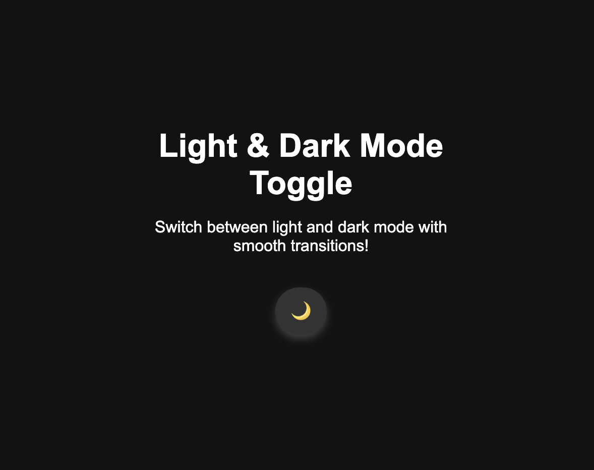

# Day 8: Light and Dark Mode Toggle with Smooth Transitions

## Project Description
This project demonstrates how to create a **Light and Dark Mode Toggle** with smooth transitions using HTML, CSS, and JavaScript. The toggle allows users to switch between light and dark themes seamlessly, providing a visually appealing and accessible user experience. The mode preference is saved using `localStorage`, ensuring the user's choice persists across sessions.

---

## Features
- **Light Mode and Dark Mode:** Effortlessly toggle between light and dark themes.
- **Smooth Transitions:** Elegant transitions for background and text colors.
- **User Preference Persistence:** Saves the selected mode in `localStorage`.
- **Interactive Button:** The toggle button changes its icon (🌞/🌙) based on the current mode.

---
# Demo page
Click [Here](https://ayshasanyang.github.io/Day-8-Light-and-Dark-Mode-Toggle/) to view the page
---

## 🚀 How to Run
1. Download or clone the repository
```bash
git clone https://github.com/ayshasanyang/Day-8-Light-and-Dark-Mode-Toggle.git
```
2. Navigate to the project folder.
3. Open the project files in your vscode or any code editor of your choice
4. Open the `index.html` file in your web browser.

---

## Technologies Used
- **HTML5:** Structure of the web page.
- **CSS3:** Styling for light/dark mode and smooth transitions.
- **JavaScript:** Logic for toggling themes and saving user preferences.

---

### 📸 Preview


---

## 📢 Connect
If you enjoyed this project, let me know! Follow me on social media to see more coding content:
- Instagram: [@codewithaysha](#)
- TikTok: [@Aysha](#)

---

